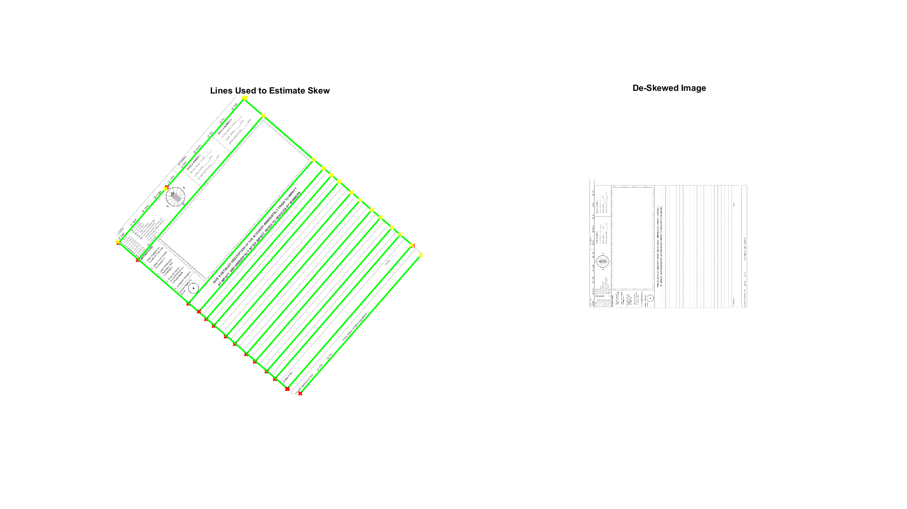

# hough-document-deskew

Find and correct skew in images of scanned documents using hough transform in Matlab. This removes the skew in a document image so that the image is aligned with some main axis. Note that this does not guarantee that the image will be rotated so that the text will be straight up and down. It only aligns the image which means the final skew of the image may be off by one of [0, 90, 180, 270] degrees off of the ideal rotation angle.

## Usage

The main function is `./src/deskew.m`. Example usage can be found in `./test_deskew.m`.

## Concept

The idea behind this approach involves finding the "dominant lines" in an image, binning them into the bins `[0, 45), [45, 90), (0, -45), [-45, -90)`, and then estimating the skew of the image by averaging the angles of the lines in the most popular bin. Then the image is rotated by this skew, making it axially-aligned.

## Examples

Test images taken from [PennDOT Driver's Accident Report](https://www.penndot.gov/ContactUs/_layouts/pa.penndot.formsandpubs/formsandpubs.aspx).

Results for the images in `./test_images`, generated using the driver script `test_deskew.m`. 

## Source

Inspired by [subrunner/deskew](https://github.com/sbrunner/deskew).

